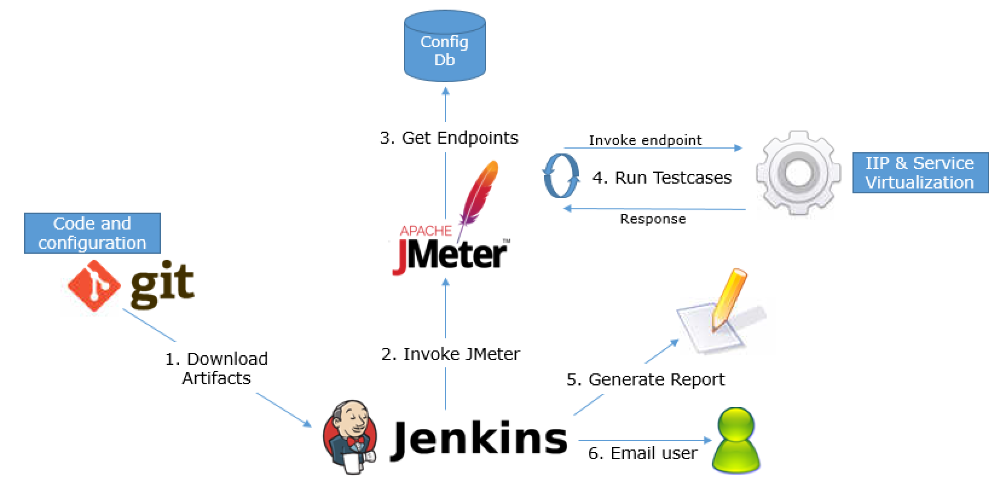

# Let's Get Started

---

## Test

---?color=linear-gradient(180deg, white 75%, black 25%)
@title[Customize Slide Layout]

@snap[west span-50]
## Customize the Layout
@snapend

@snap[east span-50]

@snapend

@snap[south span-100 text-white]
Snap Layouts let you create custom slide designs directly within your markdown.
@snapend

---?color=linear-gradient(100deg, white 50%, #567AD2 50%)
@snap[west span-40 text-center]

### Hej
@fa[quote-left quote-graphql](A query language for your API)

@snapend

---?color=linear-gradient(90deg, #E27924 65%, white 35%)
@title[Add A Little Imagination]

@snap[north-west h4-white]
#### And start presenting...
@snapend

@snap[west span-55]
@ul[spaced text-white]
- You will be amazed
- What you can achieve
- *With a little imagination...*
- And **GitPitch Markdown**
@ulend
@snapend

@snap[east span-45]
@img[shadow](assets/img/conference.png)
@snapend
